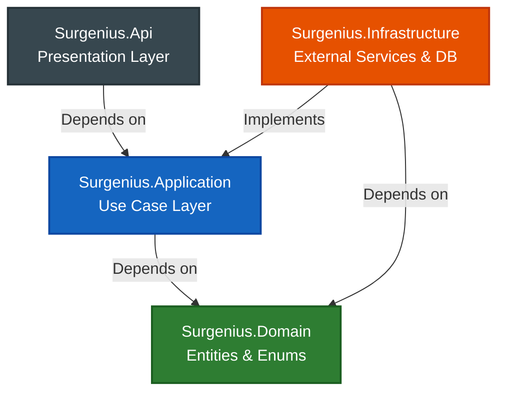
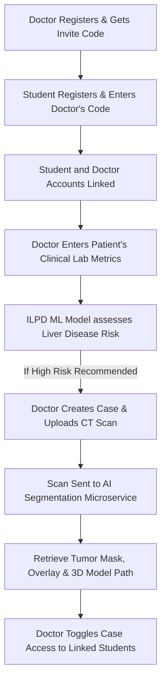

# 🧠 Surgenius - High-Performance Med-Tech Backend

[](https://dotnet.microsoft.com/)
[](https://www.microsoft.com/en-us/sql-server)
[](https://learn.microsoft.com/en-us/ef/core/)
[](https://jwt.io/)
[](https://huggingface.co/)

**Surgenius** is a secure, scalable, and high-performance medical-technology backend designed to manage surgical cases, medical imaging scans (CT/DICOM), and provide AI-driven diagnostic analysis to support surgical decision-making. 

It implements a structured clinician workflow—from clinical risk assessment to AI scan analysis and 3D organ modeling—enabling medical professors (Doctors) to supervise trainees (Students) in a secure, audited environment.

---

## 📌 Table of Contents
1. [🏗️ Architecture & Project Structure](#%EF%B8%8F-architecture--project-structure)
2. [⚙️ Core Workflows](#%EF%B8%8F-core-workflows)
3. [🛡️ Security & Authentication](#%EF%B8%8F-security--authentication)
4. [🗄️ Database & Domain Schema](#%EF%B8%8F-database--domain-schema)
5. [🌐 API Directory](#-api-directory)
6. [🛠️ Tech Stack](#%EF%B8%8F-tech-stack)
7. [🚀 Setup & Installation](#-setup--installation)

---

## 🏗️ Architecture & Project Structure

Surgenius is built using **Clean Architecture (Onion Architecture)**, separating business logic from presentation, data persistence, and external services. This guarantees that core business rules remain decoupled, testable, and maintainable.



### Layer Breakdown
*   **`Surgenius.Domain`**: Core domain logic. Contains domain models (`Case`, `Scan`, `ApplicationUser`, `AnalysisResult`, `PatientRiskAssessment`), enums, and exceptions. Independent of any libraries.
*   **`Surgenius.Application`**: Declares service interfaces, Data Transfer Objects (DTOs), mappings, validation rules, and business workflows.
*   **`Surgenius.Infrastructure`**: Concrete database implementation (Entity Framework Core & SQL Server migrations), Entity Configurations, Google/JWT authentication setup, Local File Storage handlers, and HTTP clients for external AI APIs.
*   **`Surgenius.Api`**: The entry point. Handles HTTP requests via ASP.NET Web API controllers, custom middlewares (for global exception handling), Swagger documentation, and static file mapping.

---

## ⚙️ Core Workflows

The Surgenius backend implements a logical clinical pipeline to assist surgical decision-making:



### 1. Doctor-Student Relationship (Supervised Learning)
*   **Doctors** have full autonomy to create surgical cases, run AI diagnostics, and invite students. Each doctor gets a unique, generated invite code (e.g. `DRJ-4251`).
*   **Students** register using a doctor's active invite code, establishing a secure hierarchical linkage. The doctor can toggle student access permission to all their cases at any time.

### 2. Clinical Risk Assessment
*   Independent of the scan pipeline, doctors can evaluate a patient's liver health status by providing **11 clinical lab metrics** (Age, Bilirubin, ALT/AST, Albumin, etc.).
*   The system communicates with an external **Hugging Face ML model** (trained on the Indian Liver Patient Dataset) to return the risk level, confidence, and a recommendation on whether a scan is necessary.

### 3. AI Scan Analysis & 3D Modeling
*   Doctors upload CT scans in standard image formats.
*   The backend calls an **AI Segmentation Microservice** (running on Render/FastAPI) which processes the scan and returns:
    *   AI-calculated classification stage (Numeric and text label)
    *   Prediction confidence (Percentage)
    *   Calculated tumor area in pixels
    *   Base64-encoded visual masks and highlighted overlays, decoded and saved securely onto the backend's storage
    *   Absolute URLs to the static 3D organ reconstruction model (`.obj` format)

---

## 🛡️ Security & Authentication

Surgenius enforces modern security standards to protect sensitive patient records (HIPAA/GDPR compliance ready):
*   **JSON Web Tokens (JWT)**: Secure, signed tokens mapping custom authorization claims (roles and User IDs).
*   **Role-Based Access Control (RBAC)**: Fine-grained controller rules separating `Admin`, `Doctor`, and `Student` capabilities.
*   **Dual Google OAuth**: 
    *   **Web**: Redirect-based authorization flow using Cookie authentication schemes.
    *   **Mobile (Android/iOS)**: Secure endpoint validating Google Client ID Tokens on the server-side, enabling smooth passwordless sign-ins on cross-platform apps.

---

## 🗄️ Database & Domain Schema

The domain models map to the SQL Server database schema using Entity Framework Core Fluent API:

```
┌─────────────────┐       1       * ┌──────────────┐
│ ApplicationUser ├─────────────────┤     Case     │
│ (Doctor/Student)│                 └──────┬───────┘
└────────┬────────┘                        │ 1
         │ 1                               │ *
         │ *                               ▼
┌────────┴──────────────┐           ┌──────────────┐
│PatientRiskAssessment  │           │     Scan     │
└───────────────────────┘           └──────┬───────┘
                                           │ 1
                                           │ 1 (Optional)
                                           ▼
                                    ┌──────────────┐
                                    │AnalysisResult│
                                    └──────────────┘
```

*   **`ApplicationUser`**: Extends `IdentityUser<Guid>`. Custom fields include `FullName`, `UserType` (Enum), `InviteCode`, `DoctorId` (Self-referential foreign key linking Student to Doctor), and OTP-related variables for password recovery.
*   **`Case`**: Patient registry holding `PatientName`, `Age`, `Gender`, `Phone`, `CaseType`, and creation metadata.
*   **`Scan`**: Points to physical file locations, holding upload date, type, and case association.
*   **`AnalysisResult`**: Houses the tumor segmentation data returned by the AI (stage, confidence, tumor pixel area, and paths to generated mask images/3D models).
*   **`PatientRiskAssessment`**: Stores clinical blood test parameters alongside the Hugging Face model's evaluated risk results.

---

## 🌐 API Directory

| Category | Method | Endpoint | Description | Auth Roles |
| :--- | :---: | :--- | :--- | :--- |
| **Auth** | `POST` | `/api/auth/register` | Register with email and password | Anonymous |
| | `POST` | `/api/auth/login` | Login and retrieve a JWT token | Anonymous |
| | `POST` | `/api/auth/forgot-password` | Request password reset OTP via email | Anonymous |
| | `POST` | `/api/auth/verify-code` | Verify the OTP token | Anonymous |
| | `POST` | `/api/auth/reset-password` | Reset password using verified OTP | Anonymous |
| | `POST` | `/api/auth/assign-role` | Assign user role manually (Admin only) | Admin |
| **Account** | `GET` | `/api/account/signin-google` | Google OAuth login for web browser | Anonymous |
| | `GET` | `/api/account/google-response` | Callback URL for web OAuth authentication | Anonymous |
| | `POST` | `/api/account/google-mobile-login` | Verify Google ID token from mobile client | Anonymous |
| | `POST` | `/api/account/complete-registration` | Setup role and supervisor linkage for OAuth users | Authorized |
| **Cases** | `POST` | `/api/cases` | Create a new patient surgical case | Admin, Doctor |
| | `GET` | `/api/cases` | Get cases list (supports search & stage filters) | Admin, Doctor, Student |
| | `GET` | `/api/cases/{id}` | Get specific case details | Admin, Doctor, Student |
| | `POST` | `/api/cases/toggle-access` | Toggle student access to cases | Admin, Doctor |
| | `DELETE` | `/api/cases/{id}` | Delete a surgical case | Admin, Doctor |
| **Scans** | `POST` | `/api/scans` | Upload scan file (`multipart/form-data`) | Admin, Doctor |
| | `GET` | `/api/scans/case/{caseId}` | Get all scans belonging to a case | Admin, Doctor, Student |
| **Analysis** | `POST` | `/api/analysis/process/{scanId}`| Run AI tumor segmentation analysis on a scan | Admin, Doctor |
| | `GET` | `/api/analysis/scan/{scanId}` | Get existing analysis results for a scan | Admin, Doctor, Student |
| | `POST` | `/api/analysis/assess-risk` | Predict clinical liver risk via Hugging Face model | Admin, Doctor |
| **Profile** | `GET` | `/api/profile` | Get current user's profile info | Authorized |
| | `PUT` | `/api/profile` | Update profile information | Authorized |
| | `POST` | `/api/profile/change-password` | Change user password | Authorized |
| | `GET` | `/api/profile/invite-code` | Get/Generate doctor's unique invite code | Doctor |
| | `GET` | `/api/profile/students` | Get list of students linked to a doctor | Admin, Doctor |
| | `DELETE` | `/api/profile/students/{id}` | Disconnect a student from a doctor | Admin, Doctor |

---

## 🛠️ Tech Stack

*   **Language & Framework**: C# on .NET 9.0 (ASP.NET Core Web API)
*   **Database Engine**: Microsoft SQL Server
*   **Entity Framework Core**: Code-First migrations and entity relationships
*   **Identity Provider**: Microsoft.AspNetCore.Identity with JWT Bearer Token validations
*   **Third-party integrations**: 
    *   **Google.Apis.Auth**: For secure verification of Android/Web Google login tokens
    *   **Hugging Face Spaces API**: Hosted machine learning prediction endpoints for ILPD clinical data
    *   **AI Scan Segmentation Endpoint**: REST endpoint for multi-part file uploads and tumor pixel computation

---

## 🚀 Setup & Installation

### Prerequisites
*   [.NET 9.0 SDK](https://dotnet.microsoft.com/download/dotnet/9.0)
*   [MS SQL Server Express](https://www.microsoft.com/en-us/sql-server/sql-server-downloads) (or LocalDB)

### 1. Configuration Setup
Modify the configuration in `Surgenius.Api/appsettings.json` (or use user-secrets):

```json
{
  "ConnectionStrings": {
    "DefaultConnection": "Server=YOUR_SERVER;Database=SurgeniusDb;Trusted_Connection=True;MultipleActiveResultSets=true;TrustServerCertificate=true;"
  },
  "Authentication": {
    "Google": {
      "WebClientId": "YOUR_GOOGLE_WEB_CLIENT_ID",
      "AndroidClientId": "YOUR_GOOGLE_ANDROID_CLIENT_ID",
      "ClientSecret": "YOUR_GOOGLE_CLIENT_SECRET"
    }
  },
  "Jwt": {
    "Key": "YOUR_SUPER_SECRET_SECURITY_KEY_MIN_32_CHARACTERS",
    "Issuer": "http://localhost:5000",
    "Audience": "http://localhost:5000"
  },
  "AiApi": {
    "BaseUrl": "https://your-ai-microservice-url"
  },
  "RiskApi": {
    "BaseUrl": "https://your-huggingface-space-url"
  }
}
```

### 2. Database Migrations
Run the following commands in the root of the project to initialize the database schema:

```powershell
# Restore dependencies
dotnet restore

# Apply Migrations to database
dotnet ef database update --project Surgenius.Infrastructure --startup-project Surgenius.Api
```

### 3. Run the Backend API
Start the API locally:

```powershell
dotnet run --project Surgenius.Api
```
The server will start, exposing:
*   **Interactive API documentation**: `http://localhost:5000/swagger` or `https://localhost:5001/swagger`
*   **Static file uploads server**: `http://localhost:5000/uploads/`
